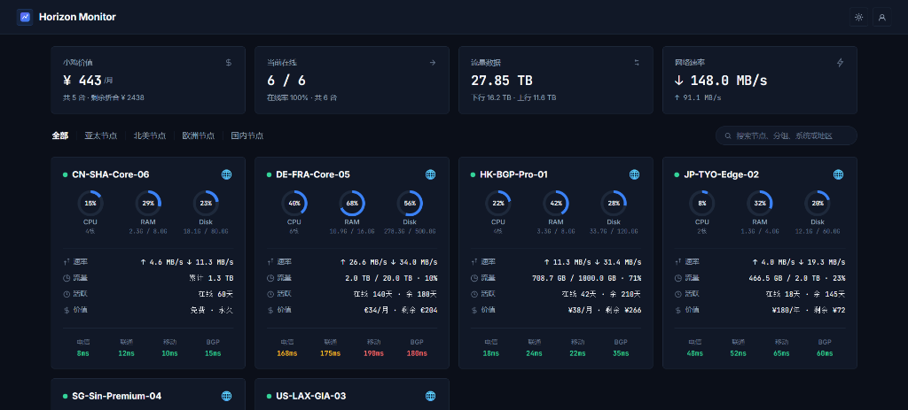

# Horizon · CF-Server-Monitor Theme

[](https://github.com/huilang-me/CF-Server-Monitor)
[](LICENSE)

一个为 [CF-Server-Monitor](https://github.com/huilang-me/CF-Server-Monitor) 探针系统量身定制的扁平、极简、现代且精准的仪表盘主题。基于原生 ES6 + 原生 SVG + 响应式 CSS 构建，提供秒级 WebSocket 实时推送、小鸡价值/剩余价值汇率折算、多运营商延迟检测与历史指标图表。

---

## 📸 预览 (Preview)



---

## ✨ 核心特性 (Features)

### 📊 首页概览面板 (Dashboard Overview)
- **顶部 4 大资产与网络统计卡片**：
  - 💰 **小鸡价值**：自动识别节点币种并通过实时汇率 API 折算为统一估值（显示月折合估值与全网剩余价值折合）。
  - 🟢 **当前在线**：实时在线节点数、在线率百分比与节点总数。
  - 📈 **流量数据**：全网节点累计下行/上行总流量。
  - ⚡ **网络速率**：实时下行（↓）与上行（↑）网络吞吐速率。
- **灵活的分类与胶囊搜索**：
  - 纯文字加粗分类标签栏（全部 | 分类1 | 分类2），极简高效。
  - 胶囊搜索框（Pill Capsule Search）：支持按节点名称、分组、系统、地区代码、CPU 或标签即时过滤。

### 🖥️ 服务器卡片 (Server Cards - 1 行 4 列)
- **状态与基本信息**：呼吸光效呼吸点（在线绿色扩散 / 离线红色）、节点名称、地区国旗图标。
- **三维资源圆环 (Dials)**：
  - CPU 占用率圆环与核心数。
  - RAM 内存使用圆环与精确占用（如 `2.0G / 3.8G`）。
  - Disk 磁盘使用圆环与精确占用（如 `23.5G / 78.6G`）。
- **指标行排版（充足呼吸间距）**：
  - **速率**：毫秒级/秒级实时上行与下行吞吐（↑ / ↓）。
  - **流量**：智能单位换算（自动换算为 TB / GB，如 `820.1 GB / 4.9 TB · 16%`）。
  - **活跃**：在线时长与到期剩余天数（如 `在线 42天 · 余 210天`）。
  - **价值**：购买价格与到期剩余价格折算（无多余小数尾数，如 `¥38/月 · 剩余 ¥266`）。
- **底部平行延迟排版**：电信、联通、移动、BGP 4 列平行并排延迟检测与智能色彩分级。

### 📈 独立详情页 (Node Detail View - `/#/server/:id`)
- **硬件与系统规格 3 大整合面板**：
  - **系统与硬件**：CPU 型号、核心与架构、操作系统与内核、运行时间、最后上报时间。
  - **内存与存储**：RAM 内存、Swap 交换分区、Disk 磁盘存储利用率进度条。
  - **网络与连接**：当前速率、本月流量、累计总流量、TCP/UDP 连接数、活跃进程数。
- **纯文字分类图表导航**：`系统负载 | 网络速率 | 延迟与丢包 | 磁盘IO` 纯文字加粗切换。
- **时间范围快速切换**：1小时、6小时、12小时、24小时、2天、4天、7天下拉选择。
- **原生 SVG 高性能交互图表**：支持多线路图例点击开关、鼠标悬浮浮动 Tooltips。

### 🌓 极简扁平设计与主题扩散特效
- **按钮中心圆形波浪扩散**：基于现代浏览器 View Transitions API，点击主题切换按钮从点击坐标向全屏波浪扩散渐变。
- **纯净扁平色彩体系**：告别厚重渐变与大圆角，采用精致直角微圆角与极细边框（Hairline Border）。
- **全端自适应响应式布局**：PC 端 4 列并排，移动端智能自适应（顶部统计 2 列双排展示）。
- **原生浏览器滚动条隐藏**：纯净无感浏览体验。

### 🛡️ 架构与安全性 (Architecture & Security)
- **Cloudflare Turnstile 原生支持**：自动适配全局人机验证流程，支持凭证缓存与安全弹窗。
- **WebSocket 实时推送 (`/api/ws`)**：
  - 批量增量更新合并，极低前端渲染与网络开销。
  - 25s 心跳保活，断线指数退避重连，浏览器切回前台（`visibilitychange`）立即自愈。
  - 15s 静默超时自动切回 REST API 轮询兜底，杜绝数据卡死。
- **多端跨域与静态部署 (`apiBase`)**：
  - 支持通过 HTML `<meta name="apiBase">` 配置跨域 Worker 后端。
  - 支持一键部署到 GitHub Pages、Cloudflare Pages、Vercel 或任意静态托管服务。

---

## 🚀 安装与使用 (Usage & Deployment)

### 方法一：通过 CF-Server-Monitor 后台配置（推荐）

1. 登录您的 **CF-Server-Monitor** 管理后台 (`/admin#admin`)。
2. 进入 **系统设置 (Settings)** -> **外观设置 (Appearance)**。
3. 在 **第三方主题 URL (Theme URL)** 中填入本仓库的 GitHub 分支地址：
   ```text
   https://github.com/akasls/Horizon-CF-Server-Monitor/tree/main
   ```
4. 保存配置，刷新前台页面即可生效！

---

### 方法二：纯静态托管部署（GitHub Pages / Cloudflare Pages 等）

如果您希望将前端静态文件单独部署在 GitHub Pages 或其他 CDN 上：

1. 克隆或下载本仓库代码。
2. 打开 `index.html`，在 `<head>` 中取消注释并填入您的 Workers API 地址：
   ```html
   <meta name="apiBase" content="https://your-cf-server-monitor.workers.dev">
   ```
3. 在您的 Cloudflare Workers 环境变量中添加 `CORS_ALLOWED_ORIGINS`，填入您的前端静态域名（例如 `https://username.github.io`）。
4. 将本仓库目录上传到 GitHub Pages 或 Cloudflare Pages 即可！

---

## 📁 目录结构 (Directory Structure)

```text
Horizon-CF-Server-Monitor/
├── index.html                  # 主题入口 HTML（符合 CFSM 第三方主题规范）
├── theme.json                  # 主题规范配置文件
├── assets/
│   ├── app.css                 # Horizon 扁平设计系统与全端响应式样式
│   ├── app.js                  # 核心运行引擎（API、WebSocket、路由、SVG 图表、汇率计算）
│   └── logo.svg                # 矢量 Logo 图标
├── docs/
│   ├── preview.png             # 主题高清预览效果图
│   └── preview.svg             # 矢量预览图
├── scripts/
│   └── package-theme.ps1       # 本地打包发布脚本
├── README.md                   # 详细使用说明与架构文档
├── LICENSE                     # MIT 开源协议
└── .gitignore
```

---

## 🛠️ 本地打包 (Packaging)

在 Windows PowerShell 下运行：
```powershell
.\scripts\package-theme.ps1
```
将在根目录下生成标准发布包 `Horizon-CF-Server-Monitor.zip`。

---

## 📄 开源许可 (License)

本项目基于 [MIT License](LICENSE) 开源。欢迎 Star、Fork 与提交 Pull Request！
