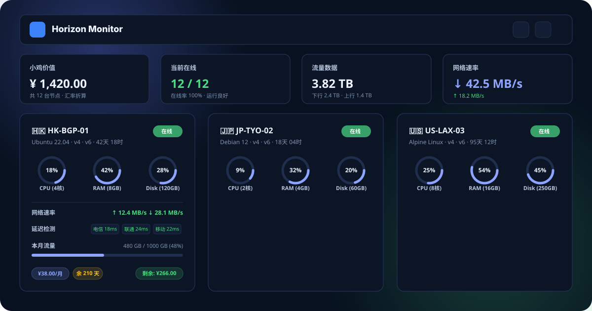

# Horizon · CF-Server-Monitor Theme

[](https://github.com/huilang-me/CF-Server-Monitor)
[](LICENSE)

一个为 [CF-Server-Monitor](https://github.com/huilang-me/CF-Server-Monitor) 探针系统量身定制的现代化、仪表盘风格轻量主题。基于原生 ES6 + 原生 SVG + 响应式 CSS 构建，提供秒级 WebSocket 实时推送、小鸡价值/剩余价值汇率折算、多运营商延迟检测与历史指标图表。

---

## 📸 预览 (Preview)



---

## ✨ 核心特性 (Features)

### 📊 首页概览面板 (Dashboard Overview)
- **顶部 4 大资产与网络统计卡片**：
  - 💰 **小鸡价值**：自动识别节点币种并通过汇率 API（Frankfurter）折算为统一估值。
  - 🟢 **当前在线**：实时在线节点数、在线率百分比与节点总数。
  - 📈 **流量数据**：全网节点累计下行/上行总流量。
  - ⚡ **网络速率**：实时下行（↓）与上行（↑）网络吞吐速率。
- **灵活的分类与搜索**：
  - 支持横向滑动分类标签，一键切换节点分组。
  - 实时关键词搜索：支持按节点名称、分组、系统、地区代码、CPU 或标签即时过滤。
- **视图切换**：支持卡片视图（Grid）与紧凑列表视图（List）自由切换。

### 🖥️ 服务器卡片 (Server Cards)
- **状态与基本信息**：地区国旗（SVG）、节点名称、系统类型、IPv4 / IPv6 支持标识、实时在线/离线状态与运行时间。
- **三维资源圆环 (Dials)**：CPU 占用率（含核心数）、RAM 内存使用（含总容量）、Disk 磁盘使用（含总容量）。
- **实时网络速率**：毫秒级/秒级上行与下行吞吐。
- **四线延迟与丢包检测**：电信 (CT)、联通 (CU)、移动 (CM)、BGP/全球 (BD) 延迟与丢包指示。
- **本月流量配额进度条**：直观展示本月已用流量与套餐限额百分比。
- **计费与剩余价值 (Fleet Worth)**：
  - 购买价格与计费周期（月付/季付/半年付/年付）。
  - 到期倒计时天数与折算剩余价值。

### 📈 独立详情页 (Node Detail View - `/#/server/:id`)
- **硬件与系统规格网格 (Specs Grid)**：CPU 型号、核心与架构、操作系统与内核、虚拟化类型、GPU 显卡、当前速率、本月流量、累计流量、内存、交换分区、磁盘空间、进程与 TCP/UDP 连接数、开机运行时间及最后上报时间。
- **时间范围快速切换**：1小时、6小时、12小时、24小时、2天、4天、7天。
- **纯原生 SVG 高性能图表**：
  - 🖥️ **系统负载图表**：CPU 利用率与 RAM 内存走势。
  - 🚀 **网络速率图表**：实时上行与下行速率曲线与渐变区域填充。
  - 📡 **延迟监测图表**：多线路 Ping 响应曲线，支持图例点击显示/隐藏特定线路。
  - 💾 **磁盘 IO 图表**：磁盘读写速率曲线。
- **交互式浮动提示 (Tooltips)**：悬浮查看具体时间点数值与详细状态。

### 🛡️ 架构与安全性 (Architecture & Security)
- **Cloudflare Turnstile 原生支持**：自动适配全局人机验证流程，支持凭证缓存与安全弹窗。
- **WebSocket 实时推送 (`/api/ws`)**：
  - 批量增量更新合并，极低前端渲染与网络开销。
  - 25s 心跳保活，断线指数退避重连，浏览器切回前台（`visibilitychange`）立即自愈。
  - 15s 静默超时自动切回 REST API 轮询兜底，杜绝数据卡死。
- **多端跨域与静态部署 (`apiBase`)**：
  - 支持通过 HTML `<meta name="apiBase">` 配置跨域 Worker 后端。
  - 支持一键部署到 GitHub Pages、Cloudflare Pages、Vercel 或任意静态托管服务。
- **深色/浅色/系统主题自适应**：支持跟随系统偏好或手动切换，支持强调色定制。

---

## 🚀 安装与使用 (Usage & Deployment)

### 方法一：通过 CF-Server-Monitor 后台配置（推荐）

1. 登录您的 **CF-Server-Monitor** 管理后台 (`/admin#admin`)。
2. 进入 **系统设置 (Settings)** -> **外观设置 (Appearance)**。
3. 在 **第三方主题 URL (Theme URL)** 中填入本仓库的 GitHub 分支地址：
   ```text
   https://github.com/akasls/Horizon-CF-Server-Monitor/tree/main
   ```
4. 保存配置，刷新前台页面即可生效！

---

### 方法二：纯静态托管部署（GitHub Pages / Cloudflare Pages 等）

如果您希望将前端静态文件单独部署在 GitHub Pages 或其他 CDN 上：

1. 克隆或下载本仓库代码。
2. 打开 `index.html`，在 `<head>` 中取消注释并填入您的 Workers API 地址：
   ```html
   <meta name="apiBase" content="https://your-cf-server-monitor.workers.dev">
   ```
3. 在您的 Cloudflare Workers 环境变量中添加 `CORS_ALLOWED_ORIGINS`，填入您的前端静态域名（例如 `https://username.github.io`）。
4. 将本仓库目录上传到 GitHub Pages 或 Cloudflare Pages 即可！

---

## 🎨 主题设置 (Theme Options)

在 CF-Server-Monitor 后台外观设置的 `theme_options` 中可传入自定义配置：

```json
{
  "accent_color": "Blue",
  "default_appearance": "System",
  "show_top_stats": true,
  "show_filter_bar": true,
  "show_region_flag": true
}
```

- `accent_color`: 强调色（可选 `Blue`, `Cyan`, `Emerald`, `Amber`, `Rose`, `Purple`）。
- `default_appearance`: 默认外观模式（可选 `System`, `Light`, `Dark`）。
- `show_top_stats`: 是否展示首页顶部统计方块。
- `show_filter_bar`: 是否展示分类导航与搜索框。
- `show_region_flag`: 是否显示国家/地区国旗。

---

## 📁 目录结构 (Directory Structure)

```text
Horizon-CF-Server-Monitor/
├── index.html                  # 主题入口 HTML（符合 CFSM 第三方主题规范）
├── assets/
│   ├── app.css                 # Horizon 现代化设计系统与响应式样式
│   ├── app.js                  # 核心运行引擎（API、WebSocket、路由、SVG 图表、汇率）
│   └── logo.svg                # 矢量 Logo 图标
├── docs/
│   └── preview.svg             # 主题预览图
├── scripts/
│   └── package-theme.ps1       # 本地打包发布脚本
├── README.md                   # 说明文档
└── .gitignore
```

---

## 🛠️ 本地打包 (Packaging)

在 Windows PowerShell 下运行：
```powershell
.\scripts\package-theme.ps1
```
将在根目录下生成标准发布包 `Horizon-CF-Server-Monitor.zip`。

---

## 📄 开源许可 (License)

本项目基于 [MIT License](LICENSE) 开源。欢迎 Star、Fork 与提交 Pull Request！
